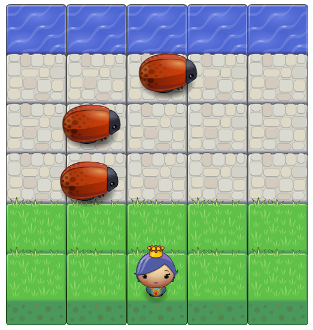

# Arcade Game Project

In this game there is a Player and Enemies (Bugs). The player can move
left, right, up and down. The enemies move in varying speeds.

## Instructions

* The player starts the game by pressing the arrow keys on the keyboard by moving up, left, right or down.
* The goal of the player is to reach the water, without colliding into any one of the enemies.
* Once the player reaches the water the game is won and player moving back to the initial location.
* Once the player collides with an enemy, the game is reset and the player moves back to the start square.
