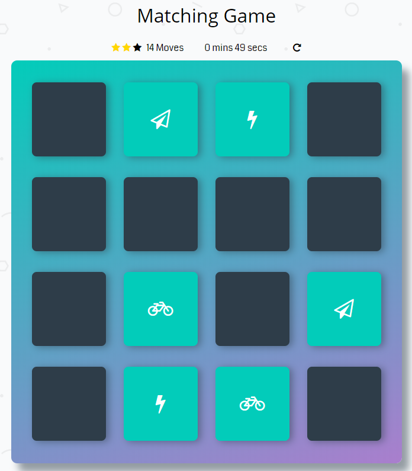

# Memory Game Project

Matching game is the game that require players to match similar elements.

## Instructions

* Click on a card this will start the game.
* The object of the game is to turn over pairs of matching cards.
* If a player succeeds in matching a pair, they have another turn and continue until they fail to match two cards. 
* The object of the game is to match cards in less time with less moves.