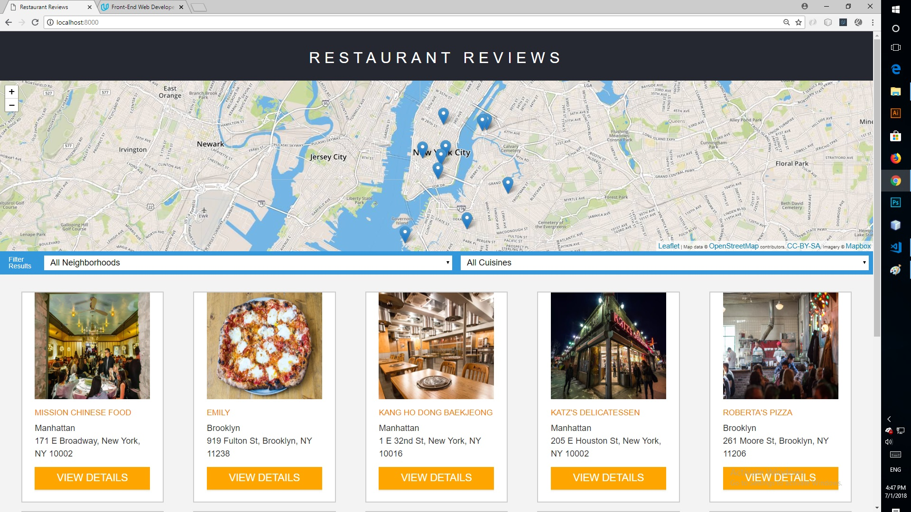

#### Restaurant Review App-Stage 1

For the **Restaurant Reviews** project a static webpage converted to a mobile-ready web application. The design customized to be responsive on different sized displays and accessible for screen reader use. Also added a ServiceWorker script to cache requests to all of the site’s assets so that any page that has been visited by a user will be accessible when the user is offline.

## How to run

1. Clone or donwload this repository to your computer
2. Open the root folder of the repository in a terminal
3. Run `npm install http-server -g'
4. Start local server: http-server . -p 8000
5. Visit [http://localhost:8000](http://localhost:8000)

